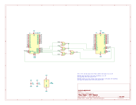

# Model_T_RAM
8K RAM module for "Model T Computers"  
* TRS-80 Model 100  
* Kyotronic KC-85  
* NEC PC-8201  
* Olivetti M10  

  

Gerbers available in [releases](../../releases/latest).

[PCB from OSHPark](https://oshpark.com/shared_projects/xsQB2kyT)  
[PCB from PCBWAY](https://www.pcbway.com/project/shareproject/Model_T_RAM.html)

[BOM from DigiKey](https://www.digikey.com/short/ft835777)

[How to do the legs](doc/DIP_PCB_legs.md)

