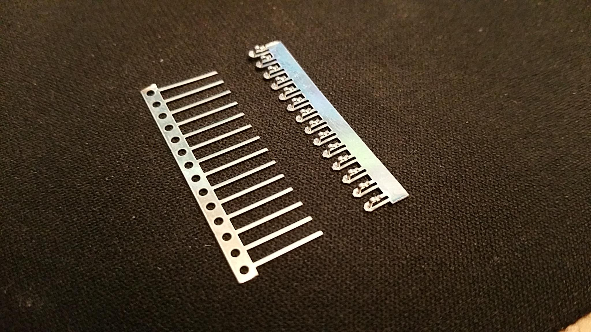
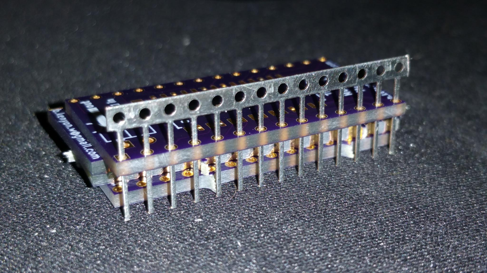
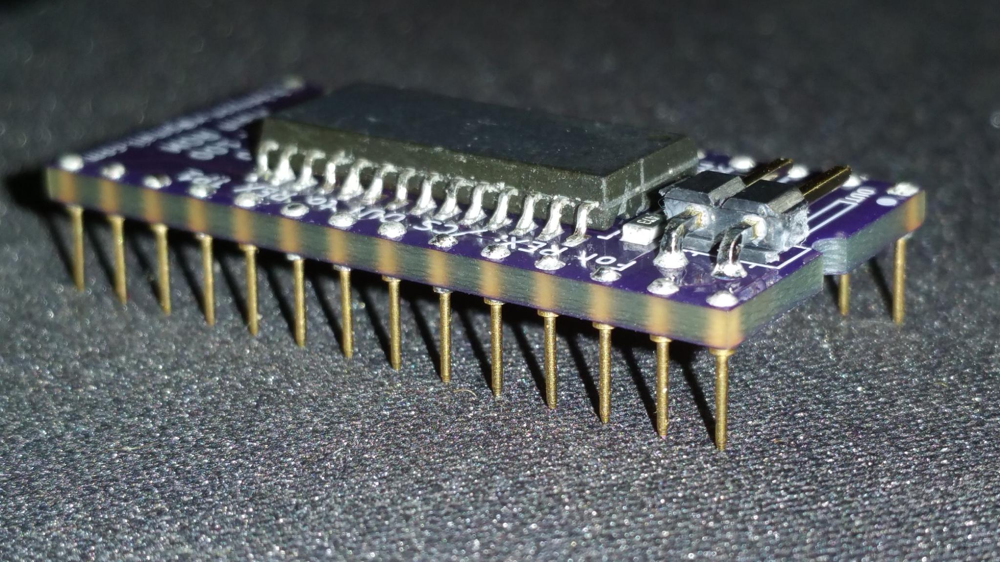
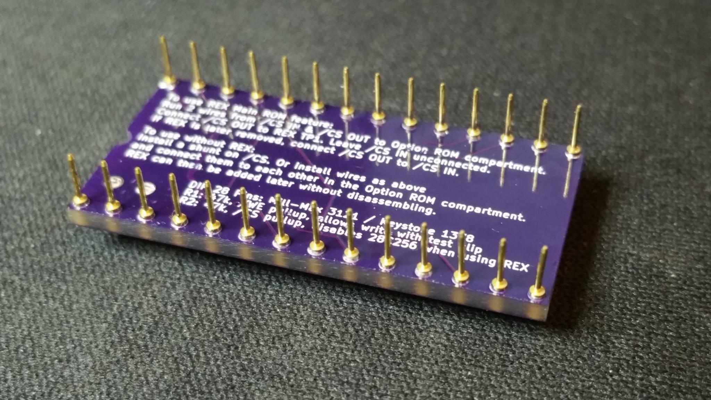
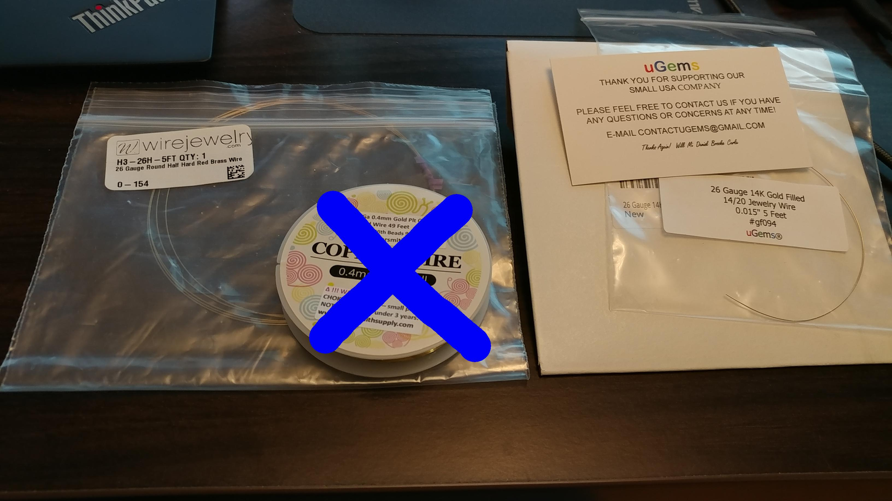
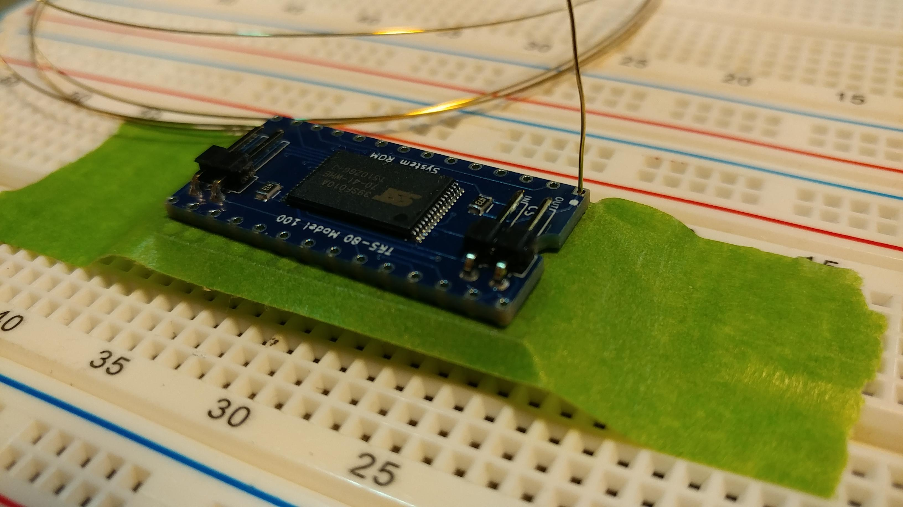
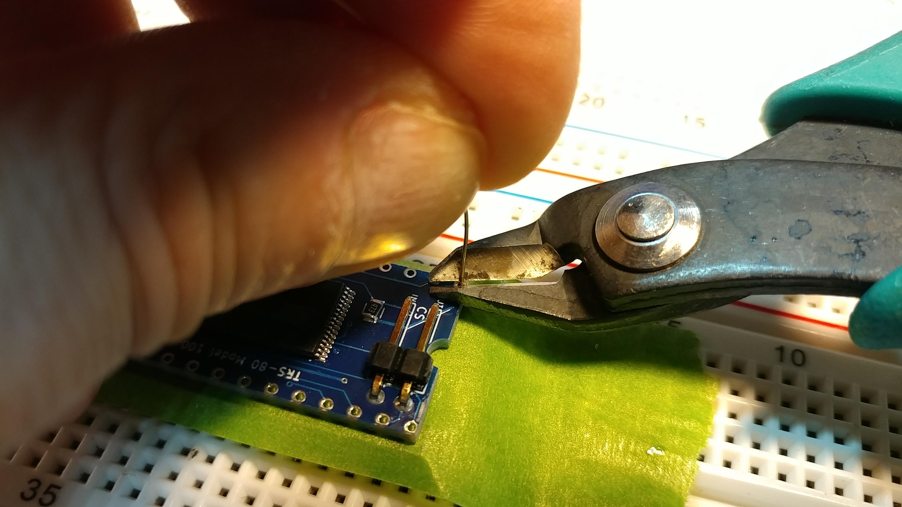
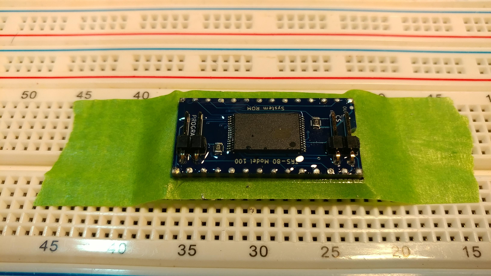
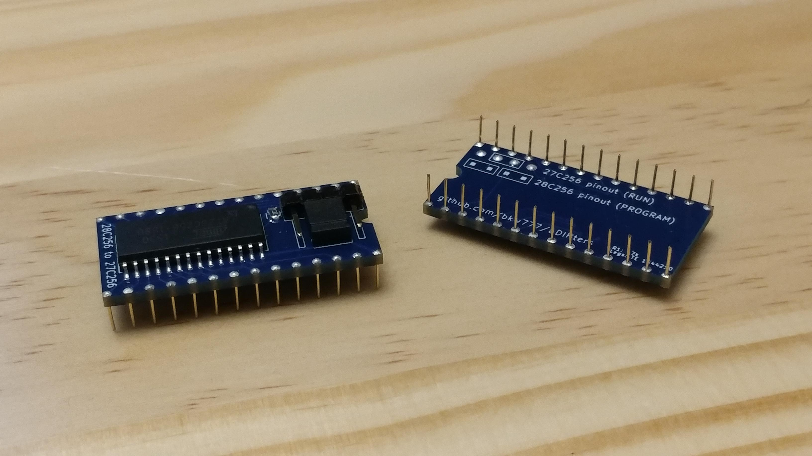

Following are a few different ways to make DIP legs on PCBs, where the legs are thin enough not to harm sockets of any type, and low profile with little or no shoulder or insulator.

The hole size to use for the plated through holes for all of these is the same, 0.6mm or 24mils.

# SIL Leadframe
[TE Connectivity 1544210 SIL leadframe](https://www.digikey.com/short/128v4wzj)  

Cut the "busy" ends off the legs with scissors, leaving a simple "comb" of legs.  

Drop that comb down from the top, leaving about 4mm of leg extending from the bottom.  

Solder, then cut the tops off flush.  

# Machined brass micro-pins  
These require no special explaination.

[Mill-Max 3121](https://www.digikey.com/short/vmmq3hf7) or [Keystone 1378](https://www.digikey.com/short/nd73r30q)

# Wire  
[gold-plated brass wire](https://duckduckgo.com/?t=canonical&q=brass+hard+gold-filled+26gauge+wire)

### materials
First you need to find a source for the wire, without getting junk wire that won't work.  
This kind of wire is usually sold for making jewelry, and the sellers do not write their descriptions with electronics use in mind, so it takes careful examination to tell suitable products from unsuitable ones.  
There are many small vendors that sometimes have this kind of wire, but the sellers come and go and their stock comes and goes.  
Also prices vary quite a bit, so don't necessarily buy the first thing you find that meets the specs.  

Start with a basic search for [gold-plated brass wire](https://duckduckgo.com/?t=canonical&q=brass+hard+gold-filled+26gauge+wire) .

You want wire that has the following properties:  
* solid brass  
* 26 gauge / 0.4 mm
* hard or half-hard temper  
* gold filled / gold plated
* round
* 1 foot length or more
* no "tarnish resistant" coating

A few good examples:  
[wirejewelry.com](https://www.wirejewelry.com/round-gold-wire/26_Gauge_Round_Half_Hard_14_20_Gold_Filled_Wire-8628-916.html)  
[etsy StirlingSilverBox](https://www.etsy.com/listing/792331329/14k-gold-filled-wires-round-wires-soft?variation0=1365993623&variation1=1347469632)  
[etsy AnniesLittleThings](https://www.etsy.com/listing/880346812/550meters-14k-real-gold-plated-brass?organic_search_click=1&pro=1&variation0=1599473932&variation1=1614789293)  
  
(The uGems one actually came from ebay, and their own web site doesn't list this item)

There are many many products that look the same and have very similar descriptions in their listings.  
You have to look over the descriptions carefully to make sure you don't get gold colored anodized aluminum wire with laquer coating.  
Avoid anything with any of these terms in the description:  
* soft, dead soft
* anti-tarnish, tarnish resistant
* colored

A single foot of wire provides about about 50 legs that are:  
* gold plated  
* the same strength/stiffness as ordinary chip legs  
* malleable enough to survive being bent and straightened a few times  
* small enough diameter not to harm sockets

You also need:  
* a standard breadboard
* a 40 pin single row machined round female pin header
* painters tape

### procedure

Solder other components on the PCB before doing the legs.

1. Break the 40-pin socket in half.  
2. Insert the two 20-pin sockets into the breadboard parallel to each other and 0.7 inches apart.  
3. Cover both sockets with painters tape. If you have 3/4" tape, use two pieces of tape, but make sure their is only a single layer of tape covering the actual socket openings on top.  
(These pictures show an 0.6" DIP PCB and an 0.6" DIP socket, but the ram module is 0.7" wide, so you need two separate single-row sockets in place of the DIP socket shown here.)  

4. Place the PCB on top of the tape & sockets. Align the PCB with the sockets under the tape.  
5. Hold the roll/loop of wire in one hand with the end of the wire in 2 fingers so that you can poke with it.  

6. Poke the wire down from the top of pin #1, through the PCB, punch through the tape, into the socket below, until the wire hits the bottom of the socket.  
   If the wire catches on the edge of the socket:  
   Hold the wire at a point about one inch away from the top of the PCB (meaning maybe back up your grip a little to hold the wire from a little further away from the PCB)  
   Lessen the downward pressure so you're only pushing down lightly  
   Move the wire around/side-side/forward-back a little until the wire drops in.  

7. Cut the wire flush with the top of the PCB.  

8. Repeat 6. and 7. for the opposite corner pin  
9. Solder those 2 corner pins.  

10 Repeat 6. and 7. for all other pins.  

11 Solder all other pins.  

Done. Lift the module out of the sockets and discard the painters tape.

If you're building multiple modules, use fresh tape for each module.

